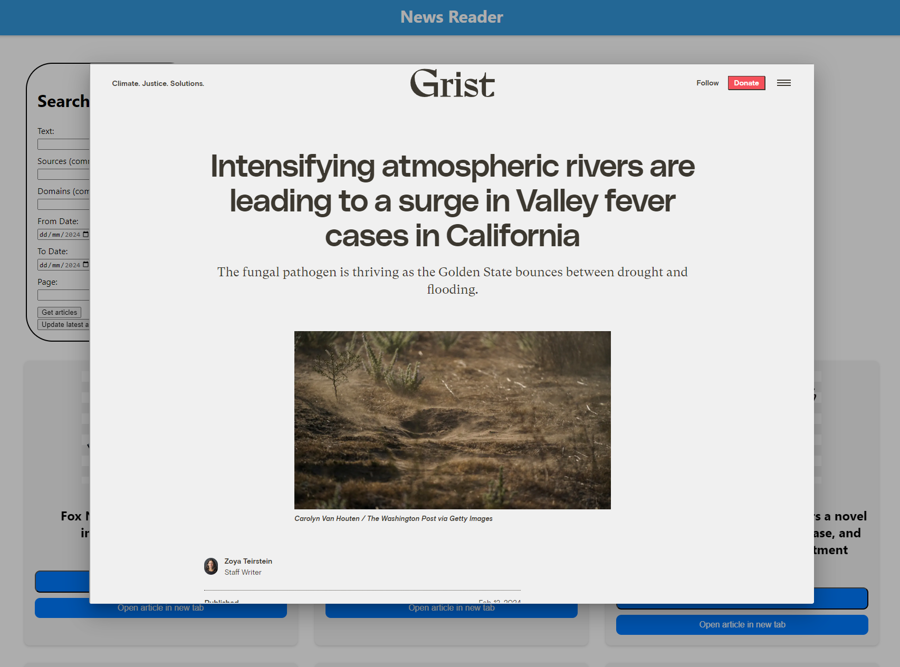

# Latest News Dashboard

Using Django REST API to fetch news articles that are stored in a PostgreSQL database before being displayed in an Angular app.

## DISCLAIMER

* Whilst I have a decent amount of experience using Flask, this is my first time working with Django. It has been fun and I expect to be using it more in the future.
* This is also my first time working with Angular being that the majority of my previous work has been backend-focused. Again, I have found it to be quite fun to learn and look forward to trying out more projects.
* Sadly, the News API doesn't seem to return a urlToImage field in its' responses. This might only be available under a paid plan but I'm not sure. As such, I have popped a placeholder image in for each article but this would preferably be a relevant image to enhance user experience.

## Table of Contents

- [Installation](#installation)
- [Usage](#usage)

## Installation

Please ensure you have the latest version of Python installed. This can be done via the [Python Website](https://www.python.org/downloads/)

You will also need an up to date version of NodeJS which can be installed via the [NodeJS Website](https://nodejs.org/en/download/current)

Finally, you will need to install PostgreSQL from the [PostgreSQL Website](https://www.postgresql.org/download/). This is to host a database locally for use with the app.

The first step will be to restore the database.
Within pgAdmin:
* Create a server with the name Local
* Set the address as localhost
* All other settings default
* Username - postgres
* Password - password
* Create a database with the name newsReaderDB
* Restore the database via the .tar file in the top level directory of this repository.

Once you have cloned all project files, you will need to build the virtual environment required for this project.

With Python installed, run the following commands in powershell:

pip install virtualenv
cd into project directory
python -m venv env
.\env\Scripts\activate

This will activate the virtual environment required to run the app.

To install the required packages run the following command:

pip install -r requirements.txt

Execute the following:
cd .\latestNewsDashboard\
python manage.py runserver

This will run the Django project

After this, open up a new Powershell window and execute the following:

cd \latestNewsDashboard\news-reader\
ng serve

This will start up the Angular app and provide you with a localhost address to ctrl+click in the terminal.

You are now free to try out this application!

## Usage

This app takes the form of a simple scrollable web page that displays 50 articles per page.

There is a box that takes search parameters.

Please note that due to API limitations, you cannot query articles from more than a month ago.
